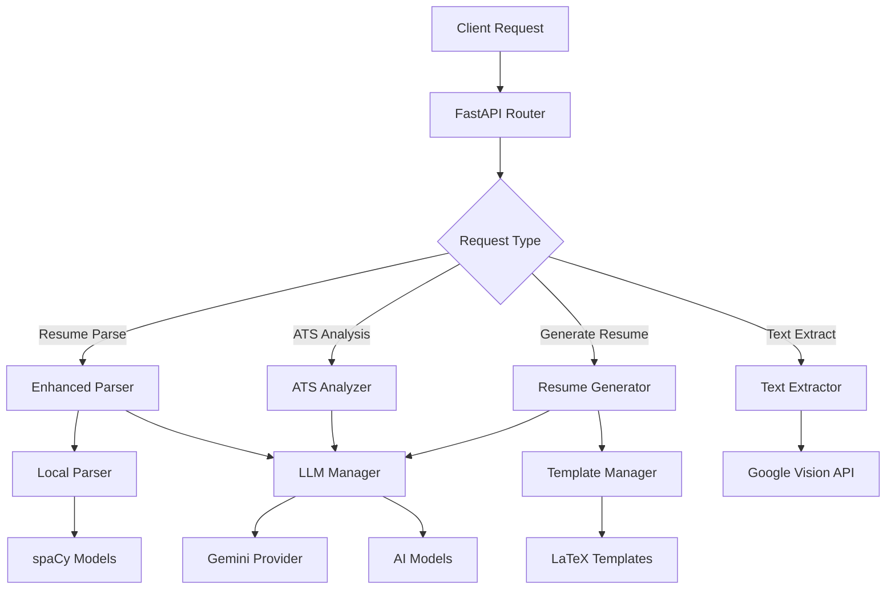

<div align="center">
  <h1>🎯 Darzi AI Resume Suite - Backend API</h1>
  <p><i>Advanced AI-powered resume parsing, ATS optimization, and LaTeX resume generation platform</i></p>
  
  [](https://opensource.org/licenses/MIT)
  [](https://www.python.org/downloads/)
  [](https://fastapi.tiangolo.com/)
  [](https://docker.com/)
  [](https://huggingface.co/spaces)
</div>

## 🚀 Overview

Darzi AI Resume Suite is a comprehensive, production-ready backend API that revolutionizes resume processing through advanced AI technologies. Built with modern Python frameworks, it provides enterprise-grade resume parsing, ATS compatibility analysis, and intelligent LaTeX resume generation capabilities.

### 🎯 Key Features

#### 🧠 **Intelligent Resume Parsing**
- **Hybrid AI Architecture**: Combines local spaCy models with LLM-powered analysis
- **Multi-Format Support**: PDF, text, and image processing capabilities
- **Structured Data Extraction**: Contact info, experience, education, skills, and projects
- **Confidence Scoring**: Reliability metrics for parsed content

#### 📊 **ATS Optimization Engine**
- **AI-Powered Analysis**: LLM-driven ATS compatibility scoring (0-100)
- **Intelligent Suggestions**: Actionable recommendations for improvement
- **Keyword Optimization**: Industry-specific keyword analysis
- **Format Compliance**: ATS-friendly structure validation

#### 🎨 **LaTeX Resume Generation**
- **Professional Templates**: 5 carefully crafted LaTeX templates
- **AI Content Enhancement**: LLM-powered content optimization
- **Template Customization**: Flexible template system with validation
- **ATS Integration**: Incorporates ATS feedback into generated resumes

#### 📄 **Advanced Text Extraction**
- **Multi-Source Processing**: PDFs, images, and Google Drive integration
- **Cost-Optimized**: Smart processing to minimize API costs
- **High Accuracy**: Google Vision API for complex documents
- **Format Preservation**: Maintains document structure and formatting

## 🏗️ Architecture



## 📚 API Documentation

### 🔍 **Resume Parsing Endpoints**

| Endpoint | Method | Description | Input | Output |
|----------|--------|-------------|-------|--------|
| `/parse-enhanced` | POST | Hybrid AI+Local parsing | PDF file | Structured resume data |
| `/parse-llm-only` | POST | Pure LLM parsing | PDF file | AI-enhanced data |
| `/parse-local-only` | POST | Local-only parsing | PDF file | spaCy-based data |
| `/parse` | POST | Legacy text parsing | Raw text | Basic structured data |

### 📊 **ATS Analysis Endpoints**

| Endpoint | Method | Description | Input | Output |
|----------|--------|-------------|-------|--------|
| `/analyze-ats` | POST | Comprehensive ATS analysis | Resume text + Job description | Detailed ATS report |
| `/ats-status` | GET | Service availability check | None | Service status |

### 🎨 **Resume Generation Endpoints**

| Endpoint | Method | Description | Input | Output |
|----------|--------|-------------|-------|--------|
| `/generate-resume` | POST | AI-powered LaTeX generation | Resume data + Template | LaTeX code |
| `/generate-resume/status` | GET | Generator service check | None | Service availability |

### 📄 **Text Extraction Endpoints**

| Endpoint | Method | Description | Input | Output |
|----------|--------|-------------|-------|--------|
| `/api/extract` | POST | File text extraction | File upload | Extracted text |
| `/api/extract-url` | POST | URL-based extraction | Google Drive URL | Extracted text |
- **Input**: PDF file upload (multipart/form-data)
- **Output**: Structured resume data extracted from PDF

#### `/optimize-ats` (POST)
Optimize resume for ATS compatibility.
- **Input**: JSON with resume_text and optional job_description
- **Output**: ATS score, suggestions, and optimization recommendations

### Text Extraction Endpoints

#### `/api/extract` (POST)
Extract text from uploaded files.
- **Input**: File upload (multipart/form-data) - supports PDF, images, text files
- **Output**: Extracted text content

#### `/api/extract-url` (POST)
Extract text from Google Drive URLs.
- **Input**: JSON with Google Drive URL
- **Output**: Extracted text content

### Utility Endpoints

#### `/health` (GET)
Health check with service status information.

#### `/mcp-status` (GET)
Check MCP service status and available tools.

#### `/healthz` (GET)
Simple health check endpoint.

## Setup

### Environment Variables

Required for text extraction functionality:
- `GOOGLE_API_KEY`: Google Cloud Vision API key (required for PDF and image processing)

Optional:
- `APP_MODE`: Set to "api" for API mode or "ui" for UI mode (default: "api")
- `API_CORS_ORIGINS`: Comma-separated list of allowed origins or "*" for all

### Local Development

1. Install dependencies:
```bash
# Using uv (recommended)
uv sync
uv run python -m spacy download en_core_web_sm

# Or using pip
pip install -r requirements.txt
python -m spacy download en_core_web_sm
```

2. Set up environment variables:
```bash
# Create .env file
echo "GOOGLE_API_KEY=your_api_key_here" > .env
```

3. Run the server:
```bash
python main.py
# Server will be available at http://localhost:7860
```

### Testing the API

#### Test Resume Parsing:
```bash
# Test text parsing
curl -X POST http://localhost:7860/parse \
  -H "Content-Type: text/plain" \
  -d "John Doe. Email: john.doe@example.com. Phone: 1234567890. Python developer with 5 years experience at Google."

# Test PDF parsing
curl -X POST http://localhost:7860/parse-pdf \
  -F 'file=@path/to/your/resume.pdf'

## 🚀 Quick Start

### 🐳 **Docker Deployment (Recommended)**

```bash
# Clone the repository
git clone https://github.com/your-org/darzi-ai-resume-suite.git
cd darzi-ai-resume-suite/backend/api

# Set up environment variables
cp .env.example .env
# Edit .env with your API keys

# Build and run with Docker
docker build -t darzi-api .
docker run -p 7860:7860 --env-file .env darzi-api
```

### 🔧 **Local Development Setup**

```bash
# Install Python 3.11+
python -m venv venv
source venv/bin/activate  # On Windows: venv\Scripts\activate

# Install dependencies
pip install -r requirements.txt
python -m spacy download en_core_web_sm

# Set environment variables
export GOOGLE_API_KEY="your-google-api-key"
export GEMINI_API_KEY="your-gemini-api-key"

# Run the application
uvicorn main:app --host 0.0.0.0 --port 7860 --reload

# Or run with Streamlit UI
streamlit run src/streamlit_app.py --server.port 8501
```

### 🌐 **HuggingFace Spaces Deployment**

This project is optimized for HuggingFace Spaces deployment with automatic Docker builds.

**Deploy URL**: [https://huggingface.co/spaces/VIT-Bhopal-AI-Innovators-Hub/darzi-api-server](https://huggingface.co/spaces/VIT-Bhopal-AI-Innovators-Hub/darzi-api-server)

## 🎨 Available LaTeX Templates

| Template | Description | Best For |
|----------|-------------|----------|
| **Professional** | Clean, traditional corporate format | Corporate jobs, traditional industries |
| **Modern** | Contemporary design with moderncv | Tech industry, consulting |
| **Academic** | Research-focused with publications | Academic positions, PhD applications |
| **Minimal** | Simple, clean design | Quick applications, basic positions |
| **Creative** | Eye-catching with colors and icons | Creative roles, design positions |

## 📖 API Usage Examples

### 🔍 **Resume Parsing**

```bash
# Enhanced parsing (AI + Local)
curl -X POST http://localhost:7860/parse-enhanced \
  -F 'file=@resume.pdf' \
  -F 'use_llm=true' \
  -F 'preferred_provider=Gemini'

# LLM-only parsing
curl -X POST http://localhost:7860/parse-llm-only \
  -F 'file=@resume.pdf' \
  -F 'preferred_provider=Gemini'

# Local-only parsing
curl -X POST http://localhost:7860/parse-local-only \
  -F 'file=@resume.pdf'
```

### 📊 **ATS Analysis**

```bash
curl -X POST http://localhost:7860/analyze-ats \
  -H "Content-Type: application/json" \
  -d '{
    "resume_text": "John Doe. Software Engineer with 5 years experience...",
    "job_description": "Looking for Senior Python Developer with React skills..."
  }'
```

### 🎨 **Resume Generation**

```bash
curl -X POST http://localhost:7860/generate-resume \
  -H "Content-Type: application/json" \
  -d '{
    "user_resume": {
      "contact_information": {
        "full_name": "John Doe",
        "email": "john@example.com",
        "phone": "555-0123"
      },
      "professional_summary": "Experienced software engineer...",
      "work_experience": [...],
      "education": [...],
      "skills": {...}
    },
    "resume_template": "\\documentclass[letterpaper,11pt]{article}...",
    "extra_info": {
      "portfolio": "https://johndoe.dev",
      "certifications": "AWS Certified"
    },
    "ats_score": 75,
    "improvement_suggestions": [
      "Add more technical keywords",
      "Include quantifiable achievements"
    ],
    "preferred_provider": "Gemini"
  }'
```

### 📄 **Text Extraction**

```bash
# Extract from file upload
curl -X POST http://localhost:7860/api/extract \
  -F 'file=@document.pdf'

# Extract from Google Drive URL
curl -X POST http://localhost:7860/api/extract-url \
  -H "Content-Type: application/json" \
  -d '{
    "url": "https://drive.google.com/file/d/FILE_ID/view"
  }'
```

## 📊 Response Examples

### Resume Parsing Response
```json
{
  "status": "success",
  "parsing_method": "enhanced",
  "parsed_by": "hybrid (local + llm)",
  "confidence_score": 0.92,
  "llm_available": true,
  "available_providers": ["Gemini (gemini-1.5-flash)"],
  "normalized_data": {
    "contact_information": {
      "full_name": "John Doe",
      "email": "john.doe@example.com",
      "phone": "(555) 123-4567",
      "location": "San Francisco, CA",
      "linkedin": "linkedin.com/in/johndoe",
      "github": "github.com/johndoe"
    },
    "professional_summary": "Experienced software engineer with 5+ years...",
    "work_experience": [
      {
        "position": "Senior Software Engineer",
        "company": "Tech Corp",
        "duration": "2022 - Present",
        "location": "San Francisco, CA",
        "responsibilities": ["Led development...", "Architected..."],
        "achievements": ["40% performance improvement", "99.9% uptime"]
      }
    ],
    "education": [...],
    "skills": {...},
    "projects": [...]
  }
}
```

### ATS Analysis Response
```json
{
  "success": true,
  "analysis": {
    "overall_score": 78,
    "analysis_method": "llm",
    "provider_used": "Gemini (gemini-1.5-flash)",
    "detailed_analysis": {
      "keyword_matching": {
        "score": 75,
        "found_keywords": ["Python", "React", "AWS"],
        "missing_keywords": ["Docker", "Kubernetes"],
        "analysis": "Good keyword coverage with room for improvement"
      },
      "content_quality": {
        "score": 85,
        "strengths": ["Quantified achievements", "Clear structure"],
        "weaknesses": ["Could use more action verbs"]
      },
      "formatting": {
        "score": 90,
        "assessment": "Excellent ATS-friendly formatting"
      }
    },
    "improvement_suggestions": [
      "Add Docker and Kubernetes to skills section",
      "Include more quantified achievements",
      "Use stronger action verbs in experience descriptions"
    ]
  }
}
```

### Resume Generation Response
```json
{
  "success": true,
  "latex_code": "\\documentclass[letterpaper,11pt]{article}\n\\usepackage[geometry]...",
  "provider_used": "Gemini (gemini-1.5-flash)",
  "metadata": {
    "prompt_length": 4153,
    "response_length": 3420,
    "available_providers": ["Gemini (gemini-1.5-flash)"],
    "generation_method": "llm"
  }
}
```

## 🔧 Configuration

### Environment Variables

```bash
# Required for LLM features
GEMINI_API_KEY=your_gemini_api_key

# Required for Vision API (PDF/image text extraction)
GOOGLE_API_KEY=your_google_vision_api_key

# Optional configuration
API_BASE_URL=http://localhost:7860
APP_MODE=api  # or 'ui' for Streamlit
PORT=7860
```

### Docker Environment
```bash
# Set deployment mode
ENV APP_MODE=api  # 'api' for FastAPI, 'ui' for Streamlit

# Port configuration
ENV PORT=7860

# Python path for imports
ENV PYTHONPATH=/code/src
```

## 🧪 Testing

### Health Checks
```bash
# API health
curl http://localhost:7860/health

# Service status checks
curl http://localhost:7860/generate-resume/status
curl http://localhost:7860/ats-status
```

### Integration Tests
```bash
# Run test suite (when implemented)
python -m pytest tests/

# Manual API testing
python scripts/test_api.py
```

## 📈 Performance & Scalability

- **Response Times**: < 2s for parsing, < 5s for resume generation
- **Concurrent Requests**: Supports multiple simultaneous requests
- **Memory Efficient**: Optimized for cloud deployment
- **Caching**: Built-in caching for model loads and repeated requests

## 🔒 Security

- **Input Validation**: Comprehensive request validation
- **File Type Checking**: Secure file upload handling
- **Rate Limiting**: API rate limiting capabilities
- **Error Handling**: Secure error responses without information leakage

## 🤝 Contributing

1. Fork the repository
2. Create a feature branch
3. Make your changes with tests
4. Submit a pull request

## 📄 License

This project is licensed under the MIT License - see the [LICENSE](LICENSE) file for details.

## 🆘 Support

- **Documentation**: [API Docs](https://your-deployment-url/docs)
- **Issues**: [GitHub Issues](https://github.com/your-org/darzi-ai-resume-suite/issues)
- **Discussions**: [GitHub Discussions](https://github.com/your-org/darzi-ai-resume-suite/discussions)

## 🏆 Acknowledgments

Built with:
- [FastAPI](https://fastapi.tiangolo.com/) - Modern Python web framework
- [spaCy](https://spacy.io/) - Advanced NLP
- [Google Gemini](https://ai.google.dev/) - Large Language Models
- [Streamlit](https://streamlit.io/) - Web UI framework
- [HuggingFace Spaces](https://huggingface.co/spaces) - ML model deployment

---

<div align="center">
  <strong>🎯 Darzi AI Resume Suite - Revolutionizing Resume Processing with AI</strong>
</div>
{
  "success": true,
  "text": "Extracted text content from the document...",
  "file_info": {
    "name": "document.pdf",
    "size": "1.2 MB",
    "type": "vision"
  }
}
```

### Docker Deployment

1. Build the Docker image:
```bash
docker build -t darzi-backend-api .
```

2. Run the Docker container:
```bash
docker run -p 7860:7860 darzi-backend-api
```

3. Access the API at `http://localhost:7860/`.

### Hugging Face Deployment

The API is configured for Hugging Face Spaces deployment:

1. **Environment Variables**:
   - `GOOGLE_API_KEY`: Add as a Secret in your Space settings
   - `APP_MODE`: Set as "api" in Space variables (default)
   - `API_CORS_ORIGINS`: Configure allowed origins if needed

2. **Docker Configuration**: The included Dockerfile is optimized for HF Spaces

3. **Access**: Use the Space URL for API endpoints

## Cost Considerations

- **Text files**: Free (direct reading)
- **PDF files**: ~$1.50 per 1,000 pages (Google Vision API)
- **Images**: ~$1.50 per 1,000 images (Google Vision API)
- **Resume parsing**: Local parsing is free, MCP service costs may apply

## File Structure

```
api/
├── src/
│   ├── __init__.py
│   ├── app.py           # Main FastAPI application (renamed from main.py)
│   ├── streamlit_app.py # Streamlit UI application
│   ├── data_extractor/
│   │   ├── __init__.py
│   │   ├── core.py      # Text extraction logic
│   │   └── utils.py     # Helper functions
│   └── utils/
│       ├── __init__.py
│       └── parser.py    # Resume parsing logic
├── main.py              # Entry point (imports from src/app.py)
├── pyproject.toml       # Dependencies
├── requirements.txt     # Pip requirements
├── Dockerfile          # Docker configuration
└── README.md           # This file
```

## Organization

This project is developed by VIT Bhopal AI Innovators Hub as part of the Darzi AI Resume Suite.